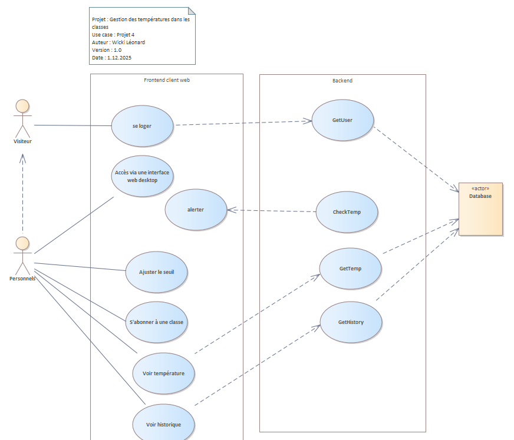

Informaticien/-ne CFC
Travail pratique individuel 2025 (TPI)

Modèle de rapport v1.4
Nom des candidats : Leonard Wiki, Gabriel Beer, Cyril Dubusc
« SensorHub »

# Sommaire

1. [Les grandes lignes du projet](#les-grandes-lignes-du-projet)  
   1.1 [Analyse de la situation initiale](#analyse-de-la-situation-initiale)  
   1.2 [Analyse de l’état désiré](#analyse-de-létat-désiré)  
   1.3 [Cahier des charges / exigences du système](#cahier-des-charges--exigences-du-système)  
   1.4 [Organisation du projet](#organisation-du-projet)

2. [Analyse préliminaire](#analyse-préliminaire)  
   2.1 [Objectifs du système](#objectifs-du-système)  
   2.2 [Variantes](#variantes)  
   2.3 [Rentabilité](#rentabilité)  
   2.4 [Analyse de risque](#analyse-de-risque)

3. [Analyse](#analyse)  
   3.1 [Cas d’utilisation](#cas-dutilisation)  
   3.2 [Diagrammes d’activités / de séquence](#diagrammes-dactivités--de-séquence)  
   3.3 [Maquettes](#maquettes)

4. [Concept](#concept)  
   4.1 [Architecture du système](#architecture-du-système)  
   4.2 [Diagramme Entité-Relation](#diagramme-entité-relation)  
   4.3 [Modèle relationnel de la base de données](#modèle-relationnel-de-la-base-de-données)  
   4.4 [Diagrammes de classes](#diagrammes-de-classes)  
   4.5 [Diagrammes de séquence des interactions](#diagrammes-de-séquence-des-interactions)  
   4.6 [Concept de tests](#concept-de-tests)

5. [Réalisation](#réalisation)

6. [Tests](#tests)  
   6.1 [Procédure de test](#procédure-de-test)  
   6.2 [Protocole de tests](#protocole-de-tests)

7. [Conclusion](#conclusion)  
   7.1 [Améliorations possibles](#améliorations-possibles)  
   7.2 [Auto-évaluation](#auto-évaluation)  
   7.3 [Conclusion du module de Gabriel](#conclusion-du-module-de-gabriel)  
   7.4 [Conclusion du module de Léonard](#conclusion-du-module-de-Léonard)  
   7.5 [Conclusion du module de Cyril](#conclusion-du-module-de-cyril)

8. [Bibliographie : liste des sources et références](#bibliographie--liste-des-sources-et-références)

9. [Glossaire](#glossaire)

# Les grandes lignes du projet

## Analyse de la situation initiale

### État actuel

Actuellement, les salles de classe de l'école EMF ne disposent pas d'un système centralisé de monitoring des conditions environnementales (température et humidité). Les variations de température et d'humidité affectent le confort des étudiants et l'efficacité pédagogique, mais il n'existe pas d'outil pour surveiller ou analyser ces paramètres en temps réel.

### Problème identifié

Sans système de monitoring, l'école ne peut pas :

- Détecter rapidement les variations anormales de température/humidité
- Analyser l'impact des conditions environnementales sur le confort des salles
- Optimiser le fonctionnement des systèmes de climatisation/ventilation
- Archiver et analyser les données historiques

### Opportunité du projet

Développer un système automatisé de monitoring des capteurs (sensorHub) permettra de :

- Surveiller en temps réel les conditions dans chaque salle de classe
- Générer des alertes en cas de dépassement de seuils
- Fournir une interface de gestion aux enseignants et administrateurs
- Collecter des données pour optimiser l'environnement scolaire

## Analyse de l'état désiré

### Système cible (sensorHub)

Le système sensorHub doit permettre :

- **Collecte de données** : Des capteurs Phidget (température et humidité) connectés à une Raspberry Pi envoient automatiquement les données à intervalles réguliers
- **Stockage centralisé** : Toutes les lectures sont stockées dans une base de données PostgreSQL avec timestamps et métadonnées
- **Consultation en temps réel** : Un tableau de bord web affiche les conditions actuelles de chaque salle avec visualisation des trends
- **Gestion des seuils** : Les administrateurs peuvent définir des seuils d'alerte pour chaque salle
- **Interface utilisateur** : Application React responsive pour desktop et mobile avec authentification par rôles (Admin, Enseignant, Élève)
- **API REST** : Backend Express.js exposant les endpoints pour consultation et gestion des données

### Architecture souhaitée

L'application est architecturée en trois composants :

1. **Frontend (React)** : Tableau de bord interactif, gestion des utilisateurs et des seuils
2. **Backend (Express.js + Prisma)** : API REST, gestion de base de données, authentification
3. **Raspberry Pi** : Script Node.js pour la lecture des capteurs Phidget et l'envoi des données

## Cahier des charges / exigences du système

### Analyse

Voici les différentes tâches exigées durant la phase d'analyse :

- Analyse du besoin du client (Intendance, Enseignants, Direction) concernant le suivi climatique des salles
- Identification des problèmes actuels : interventions réactives tardives et absence de données historiques
- Définition des objectifs du système (Objectifs SMART : monitoring temps réel, alertes ciblées, historique 7 jours)
- Détermination du périmètre du projet : inclusion du monitoring web et des alertes, exclusion de l'app mobile native
- Analyse des utilisateurs cibles (non-techniciens) et de leurs attentes en ergonomie
- Identification des contraintes techniques : Capteurs Phidget obligatoires, solution web responsive, matériel Raspberry Pi
- Analyse des contraintes temporelles : respect du budget de 43 heures et des jalons du module 306
- Définition des exigences fonctionnelles : Tableau de bord temps réel, Alertes automatisées, Historique des mesures, Configuration des seuils
- Définition des exigences non fonctionnelles (KPI) : Ergonomie (90% satisfaction), Fiabilité des alertes (95%), Facilité de prise en main (<10 min)
- Analyse des risques du projet (connexion capteurs, calibration, adoption utilisateur) et définition des mesures d’atténuation
- Validation des exigences et du cahier des charges avec le supérieur professionnel

### Conception

Voici les différentes tâches exigées durant la phase de conception

- Conception de l’architecture globale du système : Flux de données IoT (Phidget/RPi) vers Backend puis Frontend
- Choix des technologies : Capteurs Phidget HUM1000_0, Raspberry Pi (Node.js), Backend (Express/Prisma), Base de données (PostgreSQL/Neon), Frontend (React/Vite)
- Modélisation du système à l’aide de diagrammes UML (Cas d’utilisation, Classes, Séquence système)
- Conception de la structure de la base de données relationnelle (Tables : Users, Rooms, Sensors, Readings, Subscriptions)
- Définition du fonctionnement du système d’alertes : logique de comparaison des seuils min/max et déclenchement
- Conception de l’interface utilisateur : Maquettes du Tableau de bord, Page de login, Configuration des seuils
- Définition des règles de gestion : Persistance des données (historique), fréquence de lecture, gestion des erreurs capteurs
- Planification détaillée des étapes de réalisation (Sprints, répartition des tâches)
- Validation de la conception technique avant le début du développement

### Réalisation

Voici les différentes tâches exigées durant la phase de réalisation :

- Installation physique et connexion des capteurs de température et d’humidité Phidget sur le Hub/RPi
- Configuration du Raspberry Pi (OS, Node.js) pour l'exécution automatique des scripts
- Développement du script de collecte : lecture périodique des capteurs et envoi à l'API
- Mise en place du Backend v1 : Création du projet Express, configuration Prisma et connexion Neon
- Développement des API REST : Endpoints pour la réception des mesures et la consultation frontend
- Développement de l'Application Web (React) : Interface responsive, composants graphiques (charts)
- Implémentation de la logique d'alertes : Vérification des seuils à chaque réception de mesure
- Tests fonctionnels complets : Vérification de la chaine d'acquisition (Capteur -> UI) et des notifications
- Corrections de bugs et améliorations de l'interface suite aux premiers retours
- Rédaction des livrables documentaires : Guide utilisateur, Guide de démarrage, Documentation API
- Préparation et déploiement de la solution dans la salle pilote pour validation finale

## Organisation du projet

### Méthodes de gestion de projet

L'équipe utilise une méthode agile légère adaptée à la taille du groupe afin d'assurer flexibilité et visibilité :

- **Planification** : calendrier Excel pour planifier les phases (analyse, conception, réalisation, tests, documentation) et suivre les jalons du Module 306.
- **Tâches** : découpage en tâches claires et priorisées, maintenues dans un tableau de bord Kanban.
- **Suivi** : Kanban sur GitHub (colonnes : À faire, En cours, Terminé) pour le suivi quotidien de l'avancement.
- **Coordination** : points réguliers et mise à jour du journal de travail exigé par le Module 306 pour tracer l'activité de chaque membre.
- **Validation** : revues des livrables et validation par le supérieur professionnel avant les jalons clés.

Cette organisation facilite la répartition du travail, la traçabilité des actions et la réactivité en cas d'incident.

### Participants

Équipe projet :

- **Beer Gabriel** — développement frontend / tests UI
- **Wicki Léonard** — développement backend / base de données
- **Dubusc Cyril** — intégration RPi / scripts capteurs

Chaque membre contribue aux phases d'analyse, conception, réalisation, tests et documentation. Les tâches sont réparties en fonction des compétences tout en veillant à un partage des connaissances (pair programming, revues de code).

### Sauvegardes

Pour limiter les risques de perte de données et garantir la traçabilité :

- **Code & documentation** : gestion via GitHub (commits réguliers, branches de travail, historique des modifications).
- **Documents de projet** : copies sauvegardées régulièrement (ex. OneDrive ou emplacement cloud) comme prévu dans l'analyse des risques.
- **Base de données** : utilisation d'un service PostgreSQL (Neon) pour la persistance ; prévoir exports réguliers des données pour sauvegarde avant déploiement.

Ces pratiques reprennent les éléments du cahier des charges et de l'analyse des risques afin d'assurer la continuité et la reproductibilité du projet.

# Analyse préliminaire

## Objectifs du système

### Analyse de l'état actuel

L'analyse initiale reprend le Business Case et le Cahier des Charges : les salles n'ont pas de monitoring centralisé, les interventions sont réactives, et il n'existe pas d'historique exploitable. Le besoin est de fournir un outil léger, utilisable par des non-techniciens, permettant la surveillance en temps réel et l'émission d'alertes.

### Analyse de l'état désiré

L'état désiré est un système déployable en salle pilote qui collecte automatiquement la température et l'humidité via des capteurs Phidget reliés à un Raspberry Pi, stocke les lectures dans une base PostgreSQL, et fournit une interface web responsive pour consultation, configuration des seuils et gestion des abonnements.

### Objectifs

Objectifs (SMART) :

- Spécifique : fournir un tableau de bord web affichant température et humidité par salle et un système d'alertes paramétrable.
- Mesurable : historique minimum de 7 jours, KPI d'ergonomie (90% satisfaction) et fiabilité des alertes (≥95%).
- Atteignable : démarrage par un MVP (ingestion RPi → API → UI) pour valider la chaîne.
- Réaliste : respecter le périmètre défini (pas d'app native, déploiement pilote uniquement) et le budget temps (43 heures estimées).
- Temporel : livrables et déploiement pilote à la fin du Module 306.

## Variantes

Variantes considérées :

- MVP : ingestion simple, affichage temps réel, pas d'authentification forte (utilisé pour valider l'architecture).
- Version complète : authentification, gestion des utilisateurs, notifications (email/push), historique amélioré et administration des seuils.

## Rentabilité

Résumé de rentabilité attendu : réduction des interventions réactives (gain de temps pour l'intendance), amélioration du confort des apprenants, et création d'une base de données structurée pour décisions futures. Le projet vise un coût faible (utilisation de Raspberry Pi et Phidget) et une valeur ajoutée opérationnelle rapide après déploiement pilote.

## Analyse de risque

Voir cahier des charges
Faire une matrice des risques selon les risques détectés dans le business case. Exemple de matrice de risque :

| ID  | Risque                                       | Probabilité | Impact | Criticité | Plan d'atténuation                                                      |
| --- | -------------------------------------------- | ----------- | ------ | --------- | ----------------------------------------------------------------------- |
| R1  | Retard dans la livraison du prototype        | Moyenne     | Élevé  | Élevée    | Ajouter des marges dans le planning, suivi hebdomadaire                 |
| R2  | Absence d'un membre clé de l'équipe          | Faible      | Moyen  | Moyenne   | Répartition des tâches, documentation partagée                          |
| R3  | Problème technique avec un outil ou logiciel | Élevée      | Faible | Moyenne   | Prévoir une solution alternative, test préalable                        |
| R4  | Mauvaise compréhension des besoins du client | Moyenne     | Élevé  | Élevée    | Organiser des réunions régulières, valider les livrables intermédiaires |
| R5  | Difficulté à respecter les délais du sprint  | Moyenne     | Moyen  | Moyenne   | Révision du planning, priorisation des tâches dans le Kanban            |
| R6  | Perte de données ou fichiers non sauvegardés | Faible      | Élevé  | Moyenne   | Utiliser un système de sauvegarde automatique (cloud, Git, etc.)        |

# Analyse

## Cas d'utilisation

### Acteurs

Acteurs identifiés :

- **Administrateur** : configure salles, seuils et gère utilisateurs.
- **Enseignant** : consulte les salles, s'abonne aux alertes.
- **Élève** : consultation limitée des données (sensibilisation).
- **Raspberry Pi (système IoT)** : envoie les lectures via `X-API-Key`.

## Diagrammes d'activités / de séquence

Les diagrammes ont été modélisés dans Enterprise Architect et exportés dans `documentation/5_Modele_Analyses_UML.qea`. Un aperçu :

## Maquettes

Les maquettes fonctionnelles sont incarnées par les composants React dans `code/front/src/components/` (ex. `RoomCard.tsx`, `RoomDetailPage.tsx`, `RoomThresholdModal.tsx`). Le frontend utilise Recharts pour les graphiques et Radix/UI pour les composants.

# Concept

## Justifications des choix technologiques

### Vercel (hébergement frontend & backend serverless)

**Choix :** Vercel pour déployer le frontend React (Vite) ET le backend Express.js serverless

**Avantages :**

- **Déploiement unifié** : git push automatise le déploiement des deux couches simultanément
- **CDN global** : distribution du contenu statique proche des utilisateurs
- **Serverless backend** : scaling automatique sans gestion serveur, fonctions AWS Lambda
- **Intégration Github actions** : déploiement automatique à chaque push sur la branche
- **Environnements de preview** : tester les branches avant production (frontend + API) grace a des déploiements isolés
- **Analytics et monitoring** : insights sur les performances, uptime et logs des fonctions
- **Gratuité prototype** : plan gratuit couvre les besoins initiaux de déploiement

**Inconvénients :**

- **Limites serverless** : inadapté pour processus longs, risque de timeout sur requêtes lentes
- **Moins de contrôle** : configuration d'infrastructure réduite vs serveur dédié
- **Cold start** : première requête après inactivité plus lente (latence ajoutée)
- **Connexion BD** : chaque requête serverless établit nouvelle connexion Neon

### Neon (base de données PostgreSQL)

**Choix :** Neon comme service PostgreSQL managed

**Avantages :**

- **Serverless PostgreSQL** : pas de gestion de serveur, scaling automatique
- **Gratuit pour prototype** : setup immédiat, pas de facturation complexe
- **Fiabilité** : backups automatiques, haute disponibilité incluse
- **Branches de données** : capability de créer des copies pour dev/test/production
- **Performance** : infrastructure optimisée pour PostgreSQL
- **Intégration Prisma** : compatible out-of-the-box, connexion directe

**Inconvénients :**

- **Limitations gratuites** : quotas sur stockage et connexions simultanées
- **Dépendance cloud** : données hébergées chez tiers
- **Sécurité données** : vérification chiffrement au repos nécessaire pour données sensibles
- **Migration ultérieure** : difficile de migrer vers instance PostgreSQL privée si besoin de plus de contrôle

### Prisma (ORM pour Node.js/TypeScript)

**Choix :** Prisma comme ORM (Object-Relational Mapping)

**Avantages :**

- **Schéma déclaratif** : définir la BD une seule fois dans `schema.prisma`
- **Type-safe** : génération automatique de types TypeScript pour queries
- **Migrations versionnées** : `prisma migrate` crée tables et historique
- **API intuitive** : queries lisibles, pas d'écriture SQL brute
- **Gestion des relations** : simplification des jointures 1-N et N-N
- **Prisma Studio** : GUI pour visualiser et modifier les données en dev

**Inconvénients :**

- **Overhead** : génération de code supplémentaire, requêtes parfois moins optimisées
- **Courbe d'apprentissage** : syntaxe spécifique à acquérir
- **Performance critique** : SQL pur peut être plus efficace sur très haute charge

### Node.js avec boucle persistante sur Raspberry Pi plutôt qu'un cron

**Choix :** Script Node.js en Docker avec boucle `while(true)` et `sleep` au lieu d'une tâche cron Linux

**Avantages d'une boucle Node.js persistante :**

- **Meilleur contrôle des intervalles** : gestion précise des délais via code plutôt que configuration cron système qui est limité à la minute
- **Gestion d'erreurs uniforme** : mécanisme retry et logging cohérent avec le backend Express
- **Portabilité** : même code fonctionne sur n'importe quel OS disposant de Docker

**Limitations d'un cron Linux :**

- Configuration spécifique à l'OS, non portable entre systèmes
- Logs dispersés, difficiles à corréler avec les autres services
- Gestion d'erreurs primitives (sortie code, emails basiques)
- Moins de contrôle sur les timeouts et retries

**Pourquoi cette approche sur RPi :**

- Cohérence : utiliser le même runtime (Node.js) pour collecte et envoi API
- Flexibilité : adaptation facile des intervalles et logique de retry en production
- Débogage : logs directs via Docker, pas besoin d'accéder aux logs système RPi

## Architecture du système

Architecture technique :

- Couche edge : Raspberry Pi + Phidget → script Node.js envoie lectures (POST) vers l'API.
- Couche backend : Express.js expose `/api/*` (routes définies dans `code/back/src/routes/`) ; Prisma gère la persistance vers PostgreSQL (Neon).
- Couche frontend : React + Vite, consulte l'API et affiche dashboards et historiques.

## Diagramme Entité-Relation

Le schéma Prisma (`code/back/prisma/schema.prisma`) définit les entités principales : `User`, `Room`, `Sensor`, `SensorReading`, `RoomSubscription`. Voir le fichier pour la structure détaillée et les relations.

## Modèle relationnel de la base de données

Résumé du modèle relationnel :

- `users` : id, email, password (hash), role, timestamps.
- `rooms` : id, name, description, seuils (minTemp, maxTemp, minHumidity, maxHumidity), alertDelay.
- `sensors` : id, roomId, type (TEMPERATURE/HUMIDITY), serialNumber.
- `sensor_readings` : id, sensorId, value, timestamp.
- `room_subscriptions` : id, userId, roomId (unique user-room).

## Gestion des seuils et système d'abonnement

### Seuils (centralisés par room)

**Les seuils sont communs à tous les utilisateurs** et gérés au niveau de la salle, pas individuellement.

Stockés dans l'entité `rooms` :

- `minTemp`, `maxTemp` : limites température
- `minHumidity`, `maxHumidity` : limites humidité
- `alertDelay` : délai minimum entre alertes (anti-spam)

**Gestion :** Seul l'**Admin** peut modifier. À chaque lecture capteur, le backend compare la valeur aux seuils et déclenche une alerte email (via Resend) si dépassement, envoyée aux utilisateurs **abonnés** à cette salle.

### Abonnements (RoomSubscription)

**Un utilisateur ne reçoit des alertes que s'il s'est abonné** à la salle.

**Fonctionnement :**

- Bouton S'abonner/Se désabonner sur chaque salle
- Stocké dans `room_subscriptions` (relation N-N users ↔ rooms)
- Admin peut voir qui est abonné, mais ne peut pas forcer

## Diagrammes de classes

Les diagrammes de classes sont disponibles dans `documentation/5_Modele_Analyses_UML.qea` et reflètent les entités Prisma et les contrôleurs Express.

## Diagrammes de séquence des interactions

Les séquences modélisent principalement :

- Envoi de lecture : RPi → `POST /api/sensors/readings` (X-API-Key) → backend validation → création `SensorReading`.
- Consultation historique : Frontend → `GET /api/rooms/:roomId/history?period=...` → backend agrège readings → frontend affiche chart.

## Concept de tests

Stratégie de tests :

- Tests API via Postman (collection `code/back/Postman_Collection.json`).
- Tests manuels frontend pour parcours utilisateur (login, consultation, configuration seuils).
- Vérifications spécifiques : validation des plages de valeurs (backend), comportement en cas de clé API manquante/incorrecte.

### Protocole de tests

Voir la section "Tests" pour le protocole synthétique. La collection Postman contient les cas d'API essentiels (création salle, ingestion, erreurs clés API).

# Gestion des écarts scope

Cette section clarifie les divergences entre le scope initial du cahier des charges et la réalité du développement.

## Ce qui a été fait (conforme au scope)

**Fonctionnalités core livrées :**

- Tableau de bord web responsive affichant température/humidité en temps réel par salle
- Système d'alertes automatisé avec déclenchement sur seuils (Admin config, abonnement utilisateur)
- Historique des mesures consultable
- Interface web avec authentification par rôles (Admin, Enseignant, Élève)
- API REST complète pour ingestion RPi et consultation frontend
- Script RPi en Docker + Node.js pour collecte capteurs Phidget

**Infrastructure :**

- Déploiement Vercel (frontend + backend serverless)
- Base PostgreSQL Neon avec Prisma ORM
- Collection Postman pour tests API

## Écarts et ajustements

### Notifications email (adapté)

**Initialement prévu :** "Notifications email/push" génériques
**Réalisé :** Notifications email via **Resend** (spécifique)
**Justification :** Resend est un service email optimisé pour applications modernes, plus fiable que de gérer SMTP brut. Les notifications push web n'ont pas été implémentées (scope réduit prototype).

### Authentification (simplifié)

**Initialement prévu :** "Authentification par rôles avec gestion utilisateur"
**Réalisé :** Authentification sessions + rôles (Admin/Enseignant/Élève) sans 2FA
**Justification :** MVP ne nécessite pas authentification multifacteur, sessions cookies suffisantes pour prototype école.

### Historique (conforme)

**Prévu :** Minimum 7 jours
**Réalisé :** Illimité (stocké en BD, queryable sur n'importe quelle période)
**Justification :** Meilleur que prévu grâce à PostgreSQL persistant.

## Out of scope (non prévu, non fait)

Ces fonctionnalités étaient mentionnées comme "améliorations futures" ou explicitées comme hors scope :

- **App mobile native** : Explicitement exclue du cahier des charges (web responsive suffit)
- **Notifications push web** : Complexité ajoutée non prioritaire
- **Responsive design avancé** : MVP avec design basique, amélioration future possible pour ergonomie sur tous les devices
- **Déploiement multi-RPi automatisé** : Faisable mais nécessiterait infrastructure de provisioning
- **Tableau d'analyse avancée** (moyennes/percentiles) : Future phase

## Résumé des décisions

| Aspect | Scope initial | Réalisé | Impact |
|--------|---------------|---------|--------|
| Seuils | Config par room | Config admin centralisée | Plus simple, cohérent |
| Alertes | Email + push | Email via Resend | Suffisant, fiable |
| Historique | 7 jours min | Illimité | Meilleur |
| RPi | Node.js | Node.js Docker + boucle | Plus portable |

# Réalisation

Résumé de réalisation :

- Backend : implémentation Express + Prisma (`code/back/src/`), routes pour rooms, sensors, auth, subscriptions.
- Seed : `code/back/prisma/seed.ts` crée une salle `C114` et deux capteurs `PHIDGET-TEMP-001`, `PHIDGET-HUM-001`.
- Frontend : composants React et pages dans `code/front/src/`, routage géré par `AppRouter.tsx`.
- RPi : scripts d'ingestion attendus d'envoyer `X-API-Key` et payload JSON (exemples dans Postman collection).

# Tests

## Procédure de test

Procédure recommandée :

1. Importer `code/back/Postman_Collection.json` dans Postman et définir la variable `api_key`.
2. Exécuter la suite API : création de salle (`POST /api/rooms`), vérification `GET /api/rooms`, ingestion de lectures (`POST /api/rooms/:roomId/readings` et `POST /api/sensors/readings`).
3. Vérifier les codes réponses et la structure des payloads (exemples dans les contrôleurs).
4. Exécuter tests manuels frontend : login (si activé), navigation dashboard, ouverture `RoomDetailPage`, affichage graphique et sauvegarde des seuils via `RoomThresholdModal`.
5. Consigner les résultats dans le protocole de tests et noter les anomalies.

## Protocole de tests

| Numéro de test | Date | Description                    | Résultat désiré                                                |
| -------------: | ---: | ------------------------------ | -------------------------------------------------------------- |
|             F1 | (ex) | API - Create room              | 201 Created + body contenant `room`                            |
|             F2 | (ex) | API - Get rooms                | 200 OK + liste des salles avec `currentTemp`/`currentHumidity` |
|             F3 | (ex) | API - Ingest batch readings    | 201 Created, résumé `created`/`failed`                         |
|             F4 | (ex) | API - Missing API key          | 401 Unauthorized                                               |
|             F5 | (ex) | Frontend - Dashboard rendering | Affiche les `RoomCard` et indicateurs de seuils                |

# Conclusion

## Améliorations possibles

- Notifications (email / push) pour les alertes.
- Tableau d'analyse avancée sur l'historique (moyennes, percentiles, corrélations).
- Déploiement multi-salles et automatisation des sauvegardes/exports de la base.
- Tests automatisés (CI) et pipelines de déploiement.

## Auto-évaluation

À renseigner par les membres du projet : bilan compétences acquises, difficultés rencontrées et respect des objectifs temps/qualité.

## Conclusion du module de Gabriel

_(à compléter par Gabriel)_

## Conclusion du module de Léonard

Le module 306 n'a pas représenté un défi technique majeur pour moi, car les compétences en programmation étaient déjà acquises. Cependant, il a été particulièrement enrichissant du point de vue de la gestion de projet. J'ai pu apprendre et rafraîchir mes connaissances en méthodologies agiles, Scrum, planification et suivi d'un projet en équipe. Cette expérience m'a permis de mieux comprendre l'importance de la coordination, de la répartition des tâches et de l'adaptation aux imprévus, éléments essentiels pour mener à bien un projet quelqu'il soit.

## Conclusion du module de Cyril

_(à compléter par Cyril)_

# Bibliographie : liste des sources et références

- `documentation/2_CahierDesCharges.md` — Cahier des charges du projet.
- `documentation/1_BusinessCase.md` — Business Case et justification.
- `code/back/Postman_Collection.json` — Collection Postman utilisée pour les tests API.
- Documentation Phidget — pour l'intégration des capteurs (lien dans le cahier des charges).
- Prisma documentation — <https://www.prisma.io/docs>

# Glossaire

| Terme   | Définition                                                            |
| ------- | --------------------------------------------------------------------- |
| API     | Interface REST fournie par le backend (`/api` endpoints)              |
| CSV     | Comma-Separated Values — format de fichier tabulaire                 |
| IoT     | Internet of Things — système d'appareils connectés et communicants   |
| KPI     | Indicateur clé de performance (ex : ergonomie, fiabilité des alertes) |
| MVP     | Minimum Viable Product — version initiale validant la chaîne complète |
| ORM     | Object-Relational Mapping — mappage objet-relationnel pour base de données |
| Phidget | Capteurs Phidget utilisés pour température et humidité                |
| REST    | Representational State Transfer — style architectural pour API web    |
| RPi     | Raspberry Pi, unité edge qui lit les capteurs et envoie les données   |
| SQL     | Structured Query Language — langage de requête pour bases de données  |
| UI      | User Interface — interface utilisateur, ensemble d'écrans et menus     |
| UML     | Unified Modeling Language — langage de modélisation graphique         |
